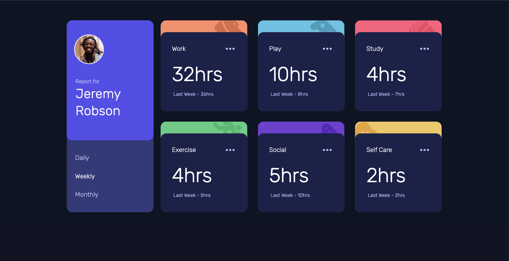

# Time Tracking Dashboard

This is a solution to the [Time tracking dashboard challenge on Frontend Mentor](https://www.frontendmentor.io/challenges/time-tracking-dashboard-UIQ7167Jw).

## Table of contents

- [Overview](#overview)
  - [The challenge](#the-challenge)
  - [Screenshot](#screenshot)
- [My process](#my-process)
  - [Built with](#built-with)
  - [What I learned](#what-i-learned)
  - [Continued development](#continued-development)
  - [Useful resources](#useful-resources)
- [Author](#author)

## Overview:

### The challenge

This is a dashboard where users should be able to:

- Switch between viewing Daily, Weekly, and Monthly stats
- View the optimal layout for the site depending on their device's screen size
- See hover states for all interactive elements on the page
- Option to copy the time spent on to the clipboard

### Screenshot



## My process

### Built with

- Mobile-first workflow
- [React + Vite](https://reactjs.org/) - JS library
- [Tailwind Css](https://tailwindcss.com/) - For styles
- CSS custom properties
- Flexbox
- CSS Grid

### What i learned

Learned to create tooltip based on accessibility role using state change onclick button click.

```jsx
        <button
            type="button"
            aria-describedby="More options to copy"
            aria-label="more options"
            aria-haspopup="true"
            aria-expanded={isActive}
            aria-controls={`tooltip-${index}`}
            onClick={toggleActive}
          >
            
          </button>
          <div
            id={`tooltip-${index}`}
            role="tooltip"
            className="tooltip | invisible absolute  -translate-x-1/2 transition-all"
          >
            Copy
          </div>
```

```css

 .tooltip::after {
    content: "";
    position: absolute;
    border-color: theme("colors.very_light_blue") transparent transparent
      transparent;
    transform: translateX(-50%);
    border-style: solid;
    border-width: 0.5rem;
  }
}
```

### Continued development

Making html dom more accessible and making use of best pratices to increase performance. Currently learning to use Lighthouse to check for bestpractices and performance of the webapp.

### Useful resources

- [aria+html = accessibilty tree](https://web.dev/learn/accessibility/aria-html)
- [aria role tooltip](https://developer.mozilla.org/en-US/docs/Web/Accessibility/ARIA/Roles/tooltip_role)
- [aria-expanded attribute to tell the user whether a drop-down menu or list is expanded or collapsed.](https://web.dev/learn/accessibility/javascript?continue=https%3A%2F%2Fweb.dev%2Flearn%2Faccessibility%23article-https%3A%2F%2Fweb.dev%2Flearn%2Faccessibility%2Fjavascript)

## Author

- Frontend Mentor - [@DivyaB28](https://www.frontendmentor.io/profile/DivyaB28)
- Twitter - [@she_divya](https://twitter.com/she_divya)
